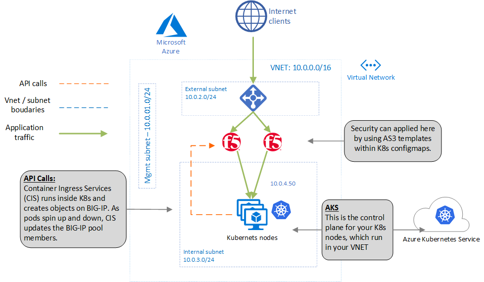

# azure-aks-bigip-terraform
Deploys Azure AKS app protected by BIG-IP for demo use
## Purpose and Overview    
This demo will configure a demo environment, running Kubernetes (AKS) and a demo app composed of microservices. This web application will be exposed to the internet via a HA-pair of BIG-IP devices. The pods running in AKS will have ephemeral, changing IP addresses every time this demo is run, however the BIG-IP is configured by F5 CIS, which runs inside Kubernetes and constantly updates the BIG-IP.

The final step of this demo is to view the web application from the internet. The URL to visit will be output in the Terraform outputs after the successful provisioning of the environment.

## Architecture    

## Pre-requisites
1. <b>You will need a Terraform client.</b> 
I personally use an Ubuntu 18.04 machine and for this demo I used Terraform version 0.12.12
2. <b>You need details of a ServicePrincipal in Azure.</b>
In this demo your Azure account will be accessed by Terraform using a Service Principal. You can set up a ServicePrincipal by following these instructions. In my example, I use a ServicePrincipal and client secret, but you can also authenticate with client certificate, or Managed Service Identity. The SP should have contributor access in the subscription.

## Instructions

Run git clone to copy the Terraform files we need locally

    git clone https://github.com/mikeoleary/azure-aks-bigip.git

We now need to update the file called variables.tf in the root module to reflect your own Service Principle details:

    cd azure-aks-bigip

... and use your favorite editor to update variables.tf, for example:

    vi variables.tf

You want your variables.tf file to include this below. Obviously, replace my xxx with your SP details, and you can create your own prefix value and Azure location if you wish. Of course, in production, use a better password than below.

    #Azure SP cred details
    variable "client_id" {default = "xxxxxxxx-xxxx-xxxx-xxxx-xxxxxxxxxxxx"}
    variable "client_secret" {default = "xxxxxxxxxxxxxxxxxxxxxxxxxxxxxxxx"}
    variable "subscription_id" {default = "xxxxxxxx-xxxx-xxxx-xxxx-xxxxxxxxxxxx"}
    variable "tenant_id" {default = "xxxxxxxx-xxxx-xxxx-xxxx-xxxxxxxxxxxx"}
    #BIG-IP variables
    variable "prefix" {default = "someuniquevalue"}
    variable "uname" {default = "azureuser"}
    variable "upassword" {default = "Default12345"}
    variable "location" {default = "East US 2"}
    #Network variables
    variable "network_cidr" {default = "10.0.0.0/16"}
    variable "mgmt_subnet_prefix" {default = "10.0.1.0/24"}
    variable "external_subnet_prefix" {default = "10.0.2.0/24"}
    variable "internal_subnet_prefix" {default = "10.0.3.0/24"}

Now let's run Terraform! You will need to type "yes" at the last prompt and *you will get billed for resources deployed*.

    terraform init
    terraform plan
    terraform apply 

Once this is complete, you should see an output called appUrl. Visit this URL, and you should see a simple demo app (the [Azure vote demo app](https://docs.microsoft.com/en-us/azure/aks/kubernetes-walkthrough)). This demo app is a good example because it involves 2 services within Kubernetes (a front end service, with multiple pods, and a backend service, with one pod). Here is the command to print this output on the screen:

    terraform output appUrl

The output of this command is a URL for you to visit. The demo is successful when you see this app below. <b>This microservices app is 2-tier, running in AKS, and exposed to the internet via the F5 BIG-IP. Now, you can apply firewall rules, iRules, SSL termination, or any other F5 app services at your F5 BIG-IP, and still get the benefit of running in AKS.</b>

Finally, don't forget to delete your resources! Again - you'll need to type "yes" when prompted.

    terraform destroy

Once in a while, Azure will destroy these resources without considering dependencies, and you'll see an error when you delete your resources. If this happens, just destroy again with the command above, or just delete the Azure Resource Group via the Azure portal.
